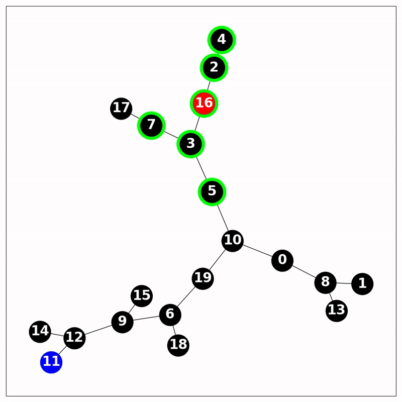

# gym-pogs

Partially Observable Graph Search

## POGS Environment

The goal of the environment is to find and reach the target node in the partially observable graph, given the information about currently visible part of the graph, current node and target node. The agent has to plan and systematically explore graph to find the target node.

Observation:
- adjacency matrix
- current node, target node
- list of edges

Action space:
- label of the node we want to travel to

### Basics

Make and initialize an environment

```
import gymnasium as gym
import gym_pogs

env = gym.make("POGS-v0", num_nodes=10, k_nearest=2)
env.seed(12)
obs, info = env.reset()
env.render()
```

### Customize environments

You can specify:
1. number of nodes
2. number of branching points / probability of branching nodes TODO
3. max_steps
4. k-nearest neighbor observability radius
5. include cycles Yes / No TODO
6. undirected 

default parameters
```
    num_nodes: int = 20, 
    max_steps: int = 50,
    k_nearest: int = 3,
```

### Render
image



observation
```
{'vector': array([0., 0., 0., 0., 0., 0., 0., 0., 0., 0., 0., 0., 0., 0., 0., 0., 0.,
        0., 0., 0., 0., 0., 0., 0., 0., 0., 0., 0., 0., 0., 0., 0., 0., 0.,
        0., 0., 0., 0., 0., 1., 0., 0., 0., 0., 0., 0., 0., 0., 0., 1., 0.,
        0., 0., 0., 0., 0., 0., 0., 0., 0., 0., 0., 0., 0., 0., 0., 0., 0.,
        0., 1., 0., 0., 0., 0., 0., 0., 0., 0., 0., 0., 0., 0., 0., 0., 0.,
        0., 0., 0., 0., 0., 0., 0., 0., 1., 1., 0., 1., 0., 0., 0., 6., 1.],
       dtype=float32),
 'current_node': np.int64(6),
 'target_node': np.int64(1),
 'edge_list': {(3, 9), (4, 9), (6, 9)}}
```

### Installation 
The command to install the repository via pip is:
```
pip install git+https://github.com/BartekCupial/gym-pogs
```